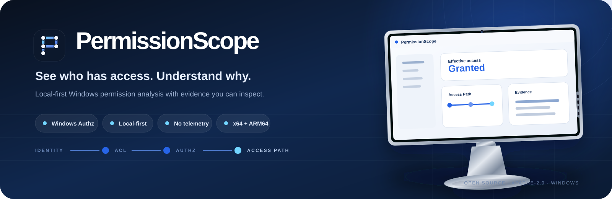

<p align="center">
  
</p>

<p align="center">
  <a href="https://github.com/MukaSanches/PermissionScope/actions/workflows/build.yml"></a>
  <a href="https://github.com/MukaSanches/PermissionScope/actions/workflows/codeql.yml"></a>
  <a href="../LICENSE"></a>
</p>

<p align="center"><strong>PermissionScope makes Windows permission decisions inspectable.</strong><br>Local-first analysis, Windows Authz evaluation, evidence-oriented explanations, snapshots, comparison, simulation and export.</p>

<p align="center">
  <a href="https://mukasanches.github.io/PermissionScope/">Website</a> ·
  <a href="https://github.com/MukaSanches/PermissionScope/releases">Download</a> ·
  <a href="../docs/TRUST-CENTER.md">Trust Center</a> ·
  <a href="../docs/courses/README.md">Academy</a> ·
  <a href="../ROADMAP.md">Roadmap</a> ·
  <a href="../SECURITY.md">Security</a>
</p>

---

## One question. An inspectable answer.

Windows permissions are rarely a single checkbox. Identity, group membership, ACL entries, inheritance and the authorization engine all contribute to the result. PermissionScope is built to show both the **decision** and the **evidence behind it**.

<table>
<tr>
<td width="33%"><strong>Local-first</strong><br><sub>No PermissionScope account, application telemetry or required cloud service.</sub></td>
<td width="33%"><strong>Windows-native decision</strong><br><sub>Effective access is evaluated with Windows Authz rather than a hand-written approximation.</sub></td>
<td width="33%"><strong>Unknown stays Unknown</strong><br><sub>Missing context is not silently converted into Granted or Denied.</sub></td>
</tr>
</table>

<p align="center">
  
</p>

## From result to evidence

PermissionScope is designed around an evidence path:

```text
Windows identity
      ↓
SID + recorded membership context
      ↓
ACL / discretionary permission entries
      ↓
Windows Authz evaluation
      ↓
Granted · Partial · Denied · Unknown
      ↓
Access Path → contributing evidence
```

The product deliberately separates what it **observed**, what Windows **evaluated**, and what PermissionScope can **safely conclude**.

## Built for verification

| Surface | What you can inspect |
|---|---|
| Source | Public repository and commit history |
| Releases | Versioned artifacts and SHA-256 checksums |
| Supply chain | CycloneDX SBOM and pinned automation where documented |
| Security | Security model, disclosure guidance and CodeQL workflow |
| Platform | x64 and ARM64 build paths |
| Documentation | Eight localized handbooks, visual guides and Academy courses |
| Privacy | Local-first design and explicit export sensitivity guidance |

Open the **[PermissionScope Trust Center](../docs/TRUST-CENTER.md)** for the complete verification surface and current limitations.

## Start safely

1. **[Download the latest release](https://github.com/MukaSanches/PermissionScope/releases)** and choose x64 for Intel/AMD or ARM64 for a Windows-on-ARM PC.
2. Verify the release SHA-256 values when installing the currently unsigned packages.
3. Start with **Explore the demo** and the synthetic `LAB\Alex` fixture.
4. Open **Access Path** to follow the evidence behind the result.
5. Move to your own files only after the model is familiar.

> Analysis and simulation are read-only. Applying a permission change is a separate, explicitly confirmed workflow with safeguards documented by the project.

## Product surface

<table>
<tr>
<td><strong>Analyze</strong><br><sub>Inspect effective access for a folder and identity.</sub></td>
<td><strong>Explain</strong><br><sub>Follow Access Path and contributing evidence.</sub></td>
<td><strong>Snapshot</strong><br><sub>Save local observations for later review.</sub></td>
</tr>
<tr>
<td><strong>Compare</strong><br><sub>Compare observations without assuming missing resources were deleted.</sub></td>
<td><strong>Simulate</strong><br><sub>Model removal of a rule in memory before considering a real change.</sub></td>
<td><strong>Export</strong><br><sub>HTML, CSV, JSON, XLSX and PDF outputs.</sub></td>
</tr>
</table>

## Learn the model, not just the buttons

The **[PermissionScope Academy](../docs/courses/README.md)** provides a learning path from Windows permission fundamentals to real diagnostics:

- [Permission fundamentals](../docs/courses/fundamentals.md)
- [Reading Access Path](../docs/courses/access-path.md)
- [Safe troubleshooting](../docs/courses/troubleshooting.md)

Localized handbooks are available in **English, Português, Español, Français, Deutsch, العربية, 日本語 and 简体中文** under [`docs/handbooks`](../docs/handbooks/README.md).

## Engineering boundaries

PermissionScope does not pretend discretionary ACL evaluation explains every possible file-open outcome. Integrity policy, encryption, locks, some remote/S4U contexts, conditional rules, administrative privilege effects and unverified reparse targets can be outside the available decision context. Those limits are documented instead of hidden.

For the technical model, see **[Access model](../docs/access-model.md)**. For planned work, see **[Roadmap](../ROADMAP.md)**. For contribution decisions, see **[Governance](../GOVERNANCE.md)**.

## Languages

[English](../README.md) · [Português](../README.pt-BR.md) · [Español](../README.es.md) · [Français](../README.fr.md) · [Deutsch](../README.de.md) · [العربية](../README.ar.md) · [日本語](../README.ja.md) · [简体中文](../README.zh-Hans.md)

---

<p align="center"><sub>Created by Samuel Sanches · Apache-2.0 · <a href="../SUPPORT.md">Support</a> · <a href="../CITATION.cff">Cite PermissionScope</a></sub></p>
