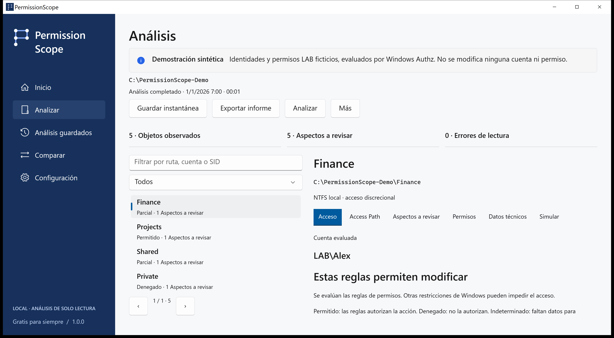
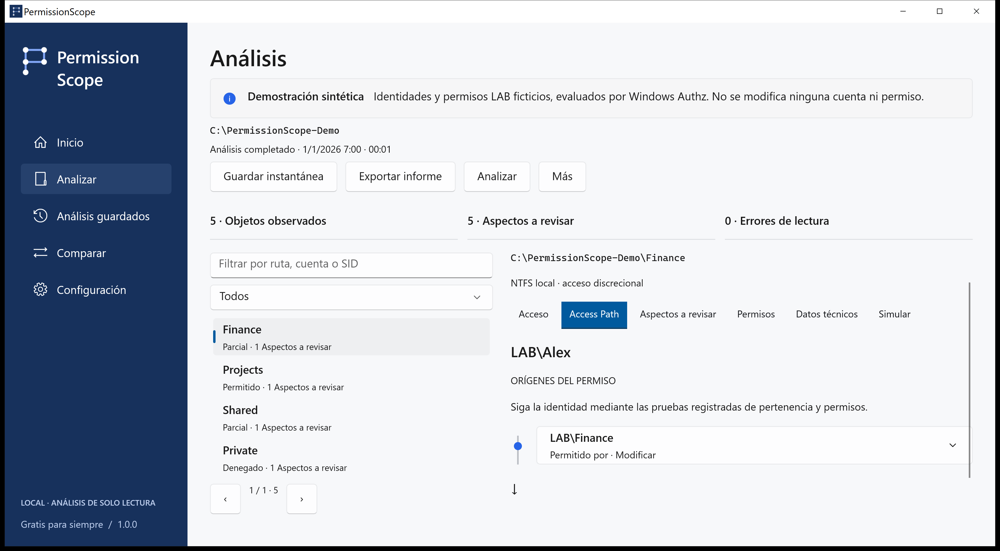

<!-- Generated from docs/content/locales.json by build/Build-Documentation.mjs. -->
# PermissionScope

[English](README.md) · [Português](README.pt-BR.md) · [Español](README.es.md) · [Français](README.fr.md) · [Deutsch](README.de.md) · [العربية](README.ar.md) · [日本語](README.ja.md) · [简体中文](README.zh-Hans.md)

Entienda quién puede acceder a una carpeta y compruebe las reglas que explican el resultado.

[Descargas de la versión](https://github.com/MukaSanches/PermissionScope/releases) · [Guía visual](docs/guides/es.md) · [Pruebe el informe HTML sintético](https://mukasanches.github.io/PermissionScope/reports/permissionscope-demo.html)



## Empiece en dos minutos

1. Descargue el instalador completo o ZIP portátil desde Releases. Elija x64 para Intel/AMD o ARM64 para un PC ARM.
2. Instale para su cuenta o extraiga todo el ZIP y abra PermissionScope.exe.
3. Explore la demostración con LAB\Alex. Para sus archivos, elija Analizar e indique una carpeta.
4. Deje la identidad vacía para usar su token actual de Windows. Abra Access Path para revisar las pruebas.

## Interprete el resultado

Permitido autoriza la acción según las reglas discrecionales evaluadas. Parcial permite algunas acciones. Denegado no concede acceso. Desconocido indica que falta contexto para confirmar el resultado; nunca equivale a permitido.

## Compruebe la explicación

Windows Authz calcula la máscara. Access Path muestra las entradas contribuyentes y las relaciones registradas. La marca de herencia no demuestra el antecesor de origen. El control total en la ACL no garantiza abrir un archivo.



## Conserve las pruebas

Guarde instantáneas locales, compare observaciones, simule quitar una regla en memoria y exporte HTML, CSV, JSON, XLSX o PDF. Un recurso ausente en la observación posterior no se considera eliminado.

```powershell
./permissionscope-cli.exe demo --output ./demo-reports
./permissionscope-cli.exe explain "C:\Finance"
./permissionscope-cli.exe scan "C:\Finance" --save
./permissionscope-cli.exe export <snapshot-id> --format html --output report.html
```

## Alcance y privacidad

Los contextos remotos, S4U, reglas condicionales y destinos de enlaces no verificados siguen siendo Desconocidos. Integridad, cifrado, bloqueos y privilegios quedan fuera. Sin telemetría, cuentas ni nube. Las exportaciones reales pueden contener rutas y nombres sensibles.

El análisis y la simulación son de solo lectura. Aplicar un cambio es un proceso separado, confirmado explícitamente, para archivos locales normales, con instantánea, registro, verificación y reversión. Se excluyen carpetas, enlaces y archivos con varios enlaces físicos.

## Descargue y verifique

Windows 10 1809 o posterior. Los paquetes completos incluyen los runtimes. Los instaladores aún no están firmados; compruebe SHA-256. ARM64 se compila en CI, sin certificación en hardware ARM. Consulte el estado para Store y WinGet.

## Elija el siguiente paso

- [Guía visual](docs/guides/es.md)
- [Modelo técnico](docs/access-model.md)
- [Preguntas y problemas](docs/faq.md)
- [Glosario sencillo](docs/glossary.md)
- [Privacidad](docs/privacy.md)
- [Estado de la versión](docs/release-status.md)

## Compilar y probar

Utilice Windows y .NET 10 SDK. Las pruebas son un ejecutable de integración, no dotnet test. Consulte la guía de desarrollo para empaquetar y verificar la documentación.

[Development](docs/development.md)

## Ayuda y colaboración

Incluya versión, Windows, operación y código de error. La pestaña Técnica copia un diagnóstico sin rutas, cuentas ni SID. Las traducciones son preliminares; las pruebas técnicas pueden seguir en inglés. No se afirma revisión nativa ni certificación de tecnologías de asistencia.

Creado por Samuel Sanches · ssanches011@gmail.com · [Apache-2.0](LICENSE) · [Security](SECURITY.md)
