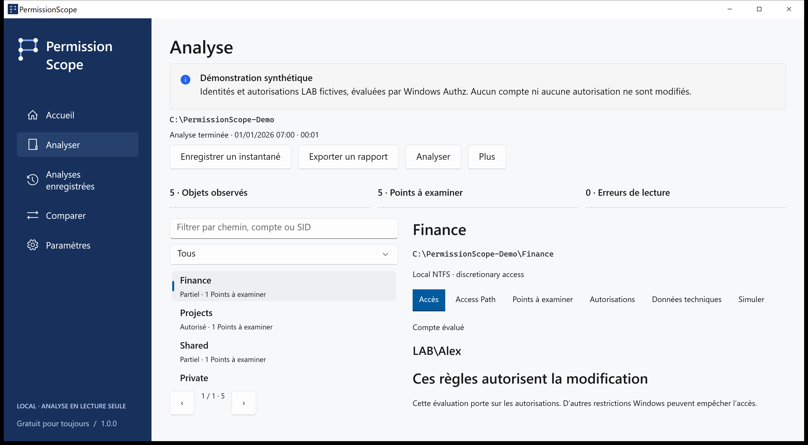
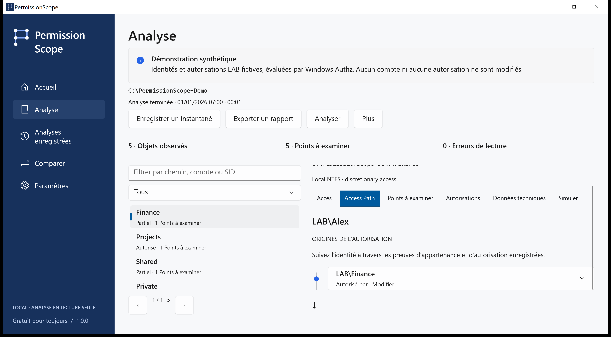

<!-- Generated from docs/content/locales.json by build/Build-Documentation.mjs. -->
# PermissionScope

[English](README.md) · [Português](README.pt-BR.md) · [Español](README.es.md) · [Français](README.fr.md) · [Deutsch](README.de.md) · [العربية](README.ar.md) · [日本語](README.ja.md) · [简体中文](README.zh-Hans.md)

Comprenez qui peut accéder à un dossier et vérifiez les règles qui expliquent la réponse.

[Téléchargements de la version](https://github.com/MukaSanches/PermissionScope/releases) · [Guide visuel](docs/guides/fr.md) · [Essayer le rapport HTML synthétique](https://mukasanches.github.io/PermissionScope/reports/permissionscope-demo.html)



## Commencer en deux minutes

1. Téléchargez l’installateur complet ou le ZIP portable depuis Releases. Choisissez x64 pour Intel/AMD ou ARM64 pour un PC ARM.
2. Installez pour votre compte ou extrayez tout le ZIP et ouvrez PermissionScope.exe.
3. Explorez la démonstration avec LAB\Alex. Pour vos fichiers, choisissez Analyser et indiquez un dossier.
4. Laissez l’identité vide pour utiliser votre jeton Windows actuel. Ouvrez Access Path pour vérifier les preuves.

## Lire le résultat

Autorisé permet l’action selon les règles discrétionnaires évaluées. Partiel permet certaines actions. Refusé n’accorde aucun accès. Inconnu signifie que le contexte ne suffit pas à confirmer la réponse ; il ne vaut jamais autorisation.

## Vérifier l’explication

Windows Authz calcule le masque. Access Path présente les entrées contributrices et les appartenances enregistrées. Un indicateur d’héritage ne prouve pas l’ancêtre d’origine. Le contrôle total dans l’ACL ne garantit pas l’ouverture d’un fichier.



## Conserver les preuves

Enregistrez des instantanés locaux, comparez les observations, simulez le retrait d’une règle en mémoire et exportez en HTML, CSV, JSON, XLSX ou PDF. Une ressource absente d’une observation ultérieure n’est pas présumée supprimée.

```powershell
./permissionscope-cli.exe demo --output ./demo-reports
./permissionscope-cli.exe explain "C:\Finance"
./permissionscope-cli.exe scan "C:\Finance" --save
./permissionscope-cli.exe export <snapshot-id> --format html --output report.html
```

## Périmètre et confidentialité

Les connexions distantes, contextes S4U, règles conditionnelles et cibles de liens non vérifiées restent Inconnus. Intégrité, chiffrement, verrous et privilèges sont hors périmètre. Sans télémétrie, compte ni service cloud. Les exports réels peuvent contenir des chemins et noms sensibles.

Analyse et simulation sont en lecture seule. Appliquer est un processus distinct, confirmé explicitement, limité aux fichiers locaux ordinaires, avec instantané, journal durable, vérification et restauration. Dossiers, liens et fichiers à liens physiques multiples sont exclus.

## Télécharger et vérifier

Windows 10 1809 ou ultérieur. Les paquets complets incluent les runtimes. Installateurs non signés : vérifiez SHA-256. ARM64 est compilé en CI, sans certification sur matériel ARM. Consultez l’état pour Store et WinGet.

## Choisir la suite

- [Guide visuel](docs/guides/fr.md)
- [Modèle technique](docs/access-model.md)
- [Questions et dépannage](docs/faq.md)
- [Glossaire simple](docs/glossary.md)
- [Confidentialité](docs/privacy.md)
- [État de la version](docs/release-status.md)

## Compiler et tester

Utilisez Windows et le SDK .NET 10. Les tests sont un exécutable d’intégration, pas dotnet test. Consultez le guide de développement pour les paquets et les vérifications documentaires.

[Development](docs/development.md)

## Aide et contribution

Indiquez version, Windows, opération et code d’erreur. L’onglet Technique copie un diagnostic sans chemins, comptes ni SID. Traductions préliminaires ; les preuves techniques peuvent rester en anglais. Aucune relecture native ni certification d’assistance n’est revendiquée.

Créé par Samuel Sanches · ssanches011@gmail.com · [Apache-2.0](LICENSE) · [Security](SECURITY.md)
