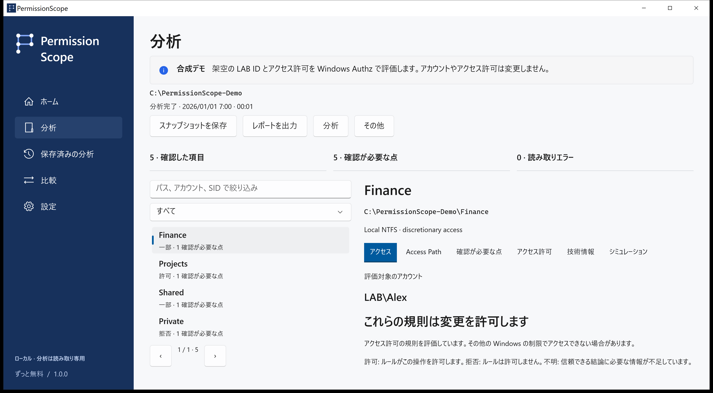
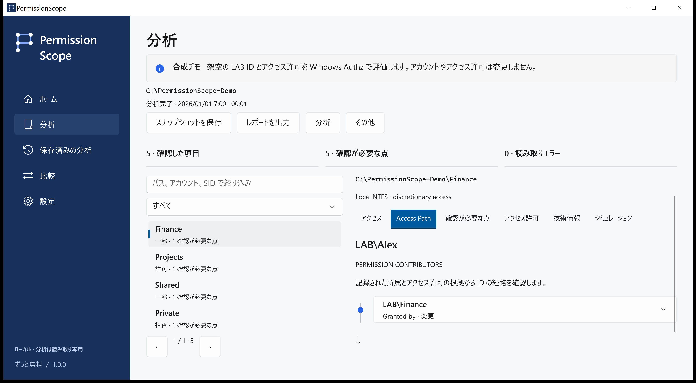

<!-- Generated from docs/content/locales.json by build/Build-Documentation.mjs. -->
# PermissionScope

[English](README.md) · [Português](README.pt-BR.md) · [Español](README.es.md) · [Français](README.fr.md) · [Deutsch](README.de.md) · [العربية](README.ar.md) · [日本語](README.ja.md) · [简体中文](README.zh-Hans.md)

フォルダーにアクセスできる人と、その結果を裏付ける規則を確認できます。

[リリースのダウンロード](https://github.com/MukaSanches/PermissionScope/releases) · [画面付きガイド](docs/guides/ja.md) · [合成 HTML レポートを試す](https://mukasanches.github.io/PermissionScope/reports/permissionscope-demo.html)



## 2分で始める

1. Releases から完全なインストーラーまたはポータブル ZIP をダウンロードします。Intel/AMD は x64、ARM PC は ARM64 を選びます。
2. 自分のアカウントにインストールするか、ZIP 全体を展開して PermissionScope.exe を開きます。
3. LAB\Alex のデモを試します。自分のファイルでは分析を選び、フォルダーを指定します。
4. ID を空欄にすると現在の Windows トークンを使います。Access Path で根拠を確認します。

## 結果を読む

許可は評価した任意アクセス制御の規則が操作を許すことです。一部は特定の操作のみ許可、拒否はアクセスの付与なしです。不明は判断に必要な情報が不足している状態で、許可として扱いません。

## 説明を検証する

Windows Authz がマスクを計算します。Access Path は寄与するエントリと記録された所属を示します。継承フラグは元の祖先を証明しません。ACL のフルコントロールもファイルを開ける保証にはなりません。



## 根拠を保存する

ローカルのスナップショットを保存・比較し、メモリ内で規則の削除をシミュレーションして HTML、CSV、JSON、XLSX、PDF に出力できます。後の観測で見つからないリソースを削除済みと断定しません。

```powershell
./permissionscope-cli.exe demo --output ./demo-reports
./permissionscope-cli.exe explain "C:\Finance"
./permissionscope-cli.exe scan "C:\Finance" --save
./permissionscope-cli.exe export <snapshot-id> --format html --output report.html
```

## 範囲とプライバシー

リモートログオン、S4U、条件付き規則、未確認のリンク先は不明のままです。整合性ポリシー、暗号化、ロック、特権は判定範囲外です。テレメトリ、アカウント、クラウドは不要です。実データのレポートには機密のパスや名前が含まれ得ます。

分析とシミュレーションは読み取り専用です。適用は明示的な確認を伴う別の手順で、通常のローカルファイルのみが対象です。保存、永続ログ、検証、ロールバックを行います。フォルダー、リンク、複数のハードリンクを持つファイルは対象外です。

## ダウンロードして検証

Windows 10 1809 以降。完全なパッケージにはランタイムが含まれます。現在のインストーラーは未署名のため SHA-256 を確認してください。ARM64 は CI でクロスビルドしており実機認証はありません。Store と WinGet はリリース状況をご確認ください。

## 次の手順

- [画面付きガイド](docs/guides/ja.md)
- [技術モデル](docs/access-model.md)
- [質問とトラブル対処](docs/faq.md)
- [やさしい用語集](docs/glossary.md)
- [プライバシー](docs/privacy.md)
- [リリース状況](docs/release-status.md)

## ビルドとテスト

Windows と .NET 10 SDK を使用します。テストは統合テスト用の実行プログラムで、dotnet test ではありません。パッケージ化と文書検証は開発ガイドを参照してください。

[Development](docs/development.md)

## ヘルプと貢献

バージョン、Windows、操作、エラーコードを記載してください。技術タブではパス、アカウント、SID を除いた診断をコピーできます。翻訳はプレビューで、技術的根拠は英語の場合があります。母語話者によるレビューや支援技術の認証は主張しません。

作成者 Samuel Sanches · ssanches011@gmail.com · [Apache-2.0](LICENSE) · [Security](SECURITY.md)
