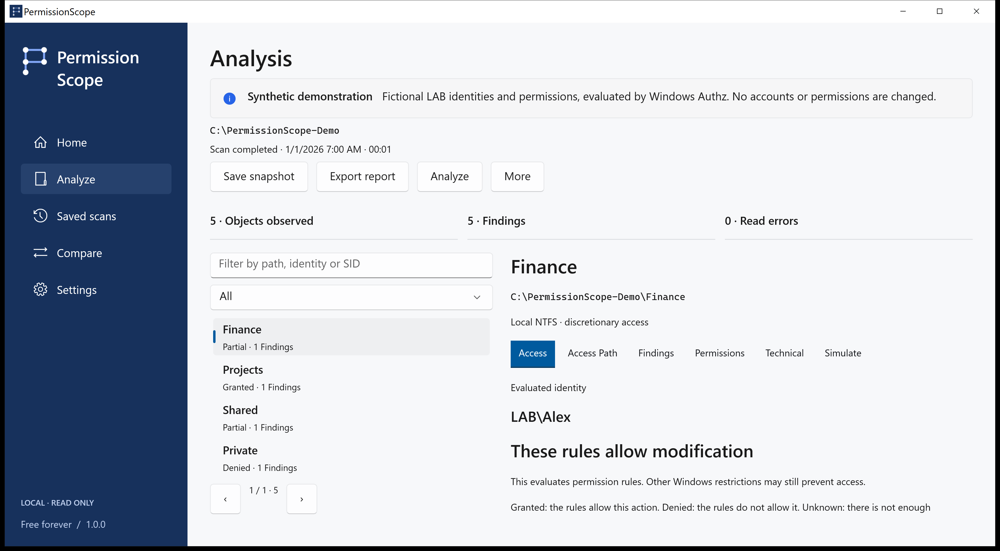
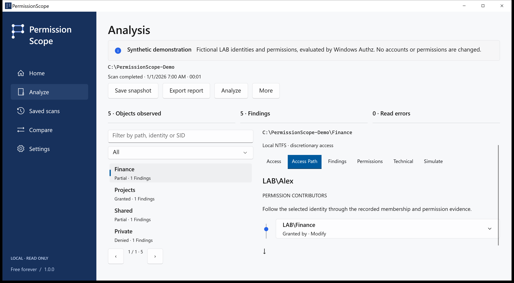

<!-- Generated from docs/content/locales.json by build/Build-Documentation.mjs. -->
# PermissionScope

[English](README.md) · [Português](README.pt-BR.md) · [Español](README.es.md) · [Français](README.fr.md) · [Deutsch](README.de.md) · [العربية](README.ar.md) · [日本語](README.ja.md) · [简体中文](README.zh-Hans.md)

Understand who can access a folder — and inspect the rules behind the answer.

[Release downloads](https://github.com/MukaSanches/PermissionScope/releases) · [Visual walkthrough](docs/guides/en-US.md) · [Try the synthetic HTML report](https://mukasanches.github.io/PermissionScope/reports/permissionscope-demo.html)



## Start in two minutes

1. Download the complete installer or portable ZIP from Releases. Choose x64 for Intel/AMD or ARM64 for an ARM PC.
2. Install for your account, or extract the entire ZIP and open PermissionScope.exe.
3. Choose Explore the demo to learn safely with LAB\Alex. For your files, choose Analyze and enter a folder.
4. Leave the identity blank to use your current Windows token. Open Access Path to inspect the evidence.

## Read the result

Granted allows the named action under the evaluated discretionary rules. Partial means only some actions are allowed. Denied means those rules grant no access. Unknown means the available context cannot confirm the answer; it is never treated as granted.

## Verify the explanation

Windows Authz calculates the mask. Access Path shows contributing entries and recorded membership evidence. Inherited flags do not prove the originating ancestor. Full control in the discretionary ACL does not guarantee a successful file open.



## Keep the evidence

Save local snapshots, compare observations, simulate removing a permission entry in memory, and export HTML, CSV, JSON, XLSX or PDF. Missing resources in a later observation are not assumed deleted.

```powershell
./permissionscope-cli.exe demo --output ./demo-reports
./permissionscope-cli.exe explain "C:\Finance"
./permissionscope-cli.exe scan "C:\Finance" --save
./permissionscope-cli.exe export <snapshot-id> --format html --output report.html
```

## Scope and privacy

Remote logons, S4U contexts, conditional rules and unverified reparse targets remain Unknown. Integrity policy, encryption, locks and administrative privileges are outside this decision. No application telemetry, accounts or cloud service. Paths and account names in real exports can be sensitive.

Analysis and simulation are read only. Applying a change is a separate, explicitly confirmed workflow for ordinary local files, with a saved observation, durable journal, verification and rollback. Directories, links and multi-link files are excluded.

## Download and verify

Windows 10 1809 or later. Complete packages include their runtimes. Installers are currently unsigned; verify SHA-256 against the release checksums. ARM64 is cross-built in CI; physical ARM execution is not certified. Store and WinGet availability must be checked in release status.

## Choose your next step

- [Visual walkthrough](docs/guides/en-US.md)
- [Technical model](docs/access-model.md)
- [FAQ and troubleshooting](docs/faq.md)
- [Plain-language glossary](docs/glossary.md)
- [Privacy](docs/privacy.md)
- [Release status](docs/release-status.md)

## Build and test

Use Windows and .NET 10 SDK. Tests are an executable integration harness, not dotnet test. See the development guide for packaging and documentation verification.

[Development](docs/development.md)

## Help and contribution

Include the version, Windows version, operation and error code. The Technical tab can copy a diagnostic without paths, account names or SIDs. Language packs are previews; technical evidence can remain in English. Native speaker review and assistive-technology certification are not claimed.

Created by Samuel Sanches · ssanches011@gmail.com · [Apache-2.0](LICENSE) · [Security](SECURITY.md)
