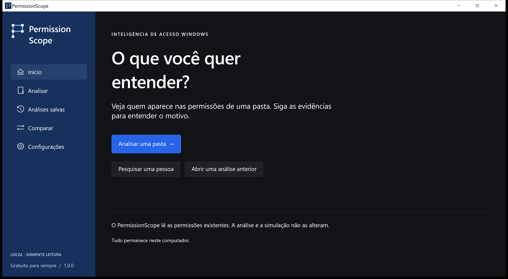
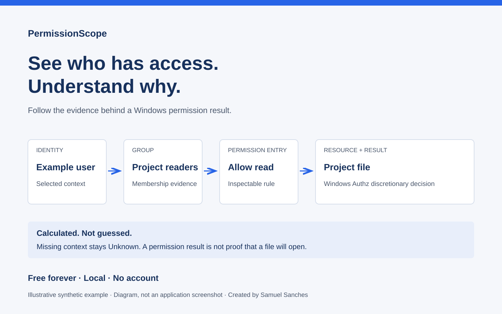

# PermissionScope

Windows access analysis and permission explainability.

See who has access. Understand why. Calculated. Not guessed.



Native C# / WinUI 3 application and CLI. Free forever, local by default, no telemetry, accounts or paid features. Created by Samuel Sanches.

## Start with one question

Select **Analyze**, choose a file or folder, and leave the identity blank to check your current Windows token. Open **Access Path** to inspect the applicable rules and available group evidence. **Technical details** retains the descriptor and masks for verification.

**Granted** means the discretionary rules allow a capability. **Denied** means they do not. **Unknown** means the available context cannot establish a reliable result. Other Windows restrictions can still prevent opening a file.



## Use

Run `PermissionScope.exe` from the complete portable directory, or use the per-user Setup installer. No separate .NET or Windows App Runtime installation is required. Keep the accompanying files together; the CLI is also the isolated scan worker.

Analyze a file, folder, UNC path or mapped drive. Inspect discretionary capabilities for your Windows token, ACL principals, individual contributing ACEs, findings and raw descriptors. Save snapshots locally, compare observations and export HTML, CSV, JSON, XLSX or PDF.

Simulation changes a descriptor in memory. The optional apply workflow is restricted to ordinary local files and requires a typed path confirmation, a saved observation, a durable rollback record and a Windows reread. Directories, reparse points and hard links are excluded from remediation.

## Calculation and scope

Windows `AuthzAccessCheck` determines the discretionary mask. PermissionScope does not infer group membership from account names or replace Authz with shell scripts. Remote/S4U projections and conditional contexts are marked **Unknown**. An ACL principal is not a count of people. A missing observation does not prove deletion.

Read [the access model](docs/access-model.md) and [supported scope](docs/release-status.md) before relying on an audit.

The [Access Test Corpus](tests/PermissionScope.Tests/corpus/README.md) contains synthetic, executable Windows permission cases. Translation coverage and review boundaries are recorded in [language quality](docs/translation-quality.md).

## Privacy

No file contents are collected during analysis. Snapshots and settings live under `%LOCALAPPDATA%\PermissionScope`. The engine contacts only the Windows resources and directories necessary for the requested scope. No application server or generative model is used.

See the [privacy policy](docs/privacy.md) and [security reporting policy](SECURITY.md). For isolated desktop tests, set the child process's `PERMISSIONSCOPE_DATA_DIR` to an absolute test directory; it does not change the normal data location for other processes. Scheduled tasks use their own process environment.

## Build and test

Requires Windows 10 1809 or later, .NET 10 SDK and Windows SDK build tools. Builds on Windows; x64 is exercised locally. The supplied isolated SDK is development tooling, not part of the source or installer.

```powershell
dotnet build PermissionScope.sln -c Release -p:Platform=x64
dotnet run --project tests/PermissionScope.Tests -c Release -- --results artifacts/test-results.json
./build/Package.ps1 -Architecture x64
```

The test project is an executable Windows integration harness; use the command above rather than `dotnet test`. Packaging uses NSIS 3.12 when available in `.toolchain/nsis-3.12`.

```powershell
./permissionscope-cli.exe explain "C:\Finance"
./permissionscope-cli.exe scan "C:\Finance" --files --save
./permissionscope-cli.exe list
./permissionscope-cli.exe export <snapshot-id> --format html --output report.html
```

## Reporting problems

Include the app version, Windows version, operation and error code. Prefer a minimal synthetic SDDL fixture over a real environment export. Never attach credentials or confidential paths without reviewing them.

Public contact: Samuel Sanches · ssanches011@gmail.com. For vulnerabilities, follow [SECURITY.md](SECURITY.md).
