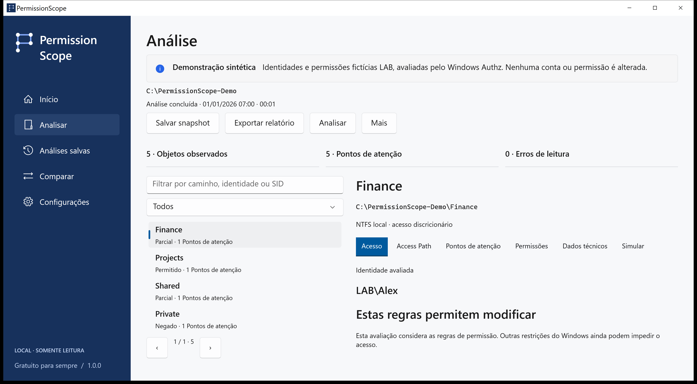
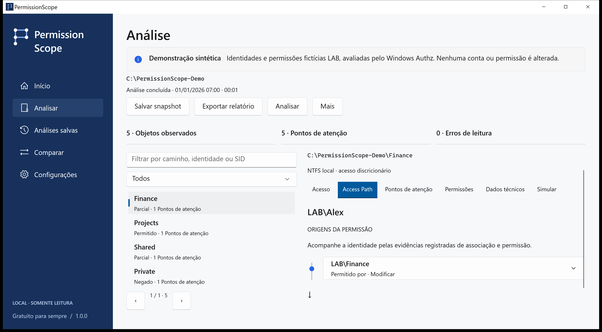

<!-- Generated from docs/content/locales.json by build/Build-Documentation.mjs. -->
# PermissionScope

[English](README.md) · [Português](README.pt-BR.md) · [Español](README.es.md) · [Français](README.fr.md) · [Deutsch](README.de.md) · [العربية](README.ar.md) · [日本語](README.ja.md) · [简体中文](README.zh-Hans.md)

Entenda quem pode acessar uma pasta e confira as regras que sustentam a resposta.

[Downloads da versão](https://github.com/MukaSanches/PermissionScope/releases) · [Guia visual](docs/guides/pt-BR.md) · [Experimente o relatório HTML sintético](https://mukasanches.github.io/PermissionScope/reports/permissionscope-demo.html)



## Comece em dois minutos

1. Baixe o instalador completo ou ZIP portátil em Releases. Escolha x64 para Intel/AMD ou ARM64 para um PC ARM.
2. Instale para sua conta ou extraia o ZIP inteiro e abra PermissionScope.exe.
3. Escolha Explorar demonstração para aprender com LAB\Alex. Para seus arquivos, escolha Analisar e informe uma pasta.
4. Deixe a identidade vazia para usar seu token Windows atual. Abra Access Path para conferir as evidências.

## Entenda o resultado

Permitido autoriza a ação indicada pelas regras discricionárias avaliadas. Parcial permite apenas algumas ações. Negado significa que essas regras não concedem acesso. Desconhecido indica contexto insuficiente para confirmar a resposta; nunca é tratado como permitido.

## Confira a explicação

O Windows Authz calcula a máscara. Access Path mostra as entradas que contribuem e as associações registradas. O sinalizador de herança não comprova a pasta de origem. Controle total na ACL discricionária não garante que um arquivo possa ser aberto.



## Preserve as evidências

Salve snapshots locais, compare observações, simule a remoção de uma regra em memória e exporte HTML, CSV, JSON, XLSX ou PDF. Um recurso ausente na observação posterior não é considerado excluído automaticamente.

```powershell
./permissionscope-cli.exe demo --output ./demo-reports
./permissionscope-cli.exe explain "C:\Finance"
./permissionscope-cli.exe scan "C:\Finance" --save
./permissionscope-cli.exe export <snapshot-id> --format html --output report.html
```

## Escopo e privacidade

Logons remotos, contextos S4U, regras condicionais e destinos de links não verificados permanecem Desconhecidos. Integridade, criptografia, bloqueios e privilégios administrativos ficam fora dessa decisão. Sem telemetria, conta ou serviço em nuvem. Caminhos e nomes em exportações reais podem ser sensíveis.

Análise e simulação apenas leem. Aplicar é um fluxo separado, confirmado explicitamente, para arquivos locais comuns, com observação salva, registro durável, verificação e reversão. Pastas, links e arquivos com vários hard links são excluídos.

## Baixe e confira

Windows 10 1809 ou posterior. Pacotes completos incluem os runtimes. Instaladores ainda sem assinatura digital; confira SHA-256 com os hashes da release. ARM64 é compilado no CI, sem certificação em hardware ARM. Consulte o status para disponibilidade na Store e no WinGet.

## Escolha o próximo passo

- [Guia visual](docs/guides/pt-BR.md)
- [Modelo técnico](docs/access-model.md)
- [Perguntas e solução de problemas](docs/faq.md)
- [Glossário em linguagem simples](docs/glossary.md)
- [Privacidade](docs/privacy.md)
- [Status da versão](docs/release-status.md)

## Compile e teste

Use Windows e o SDK .NET 10. Os testes usam um executável de integração, não dotnet test. Veja o guia de desenvolvimento para empacotamento e verificação documental.

[Development](docs/development.md)

## Ajuda e contribuição

Informe versão, Windows, operação e código de erro. A aba Técnica copia um diagnóstico sem caminhos, contas ou SIDs. Traduções são prévias; evidências técnicas podem permanecer em inglês. Não alegamos revisão por falantes nativos nem certificação assistiva.

Criado por Samuel Sanches · ssanches011@gmail.com · [Apache-2.0](LICENSE) · [Security](SECURITY.md)
