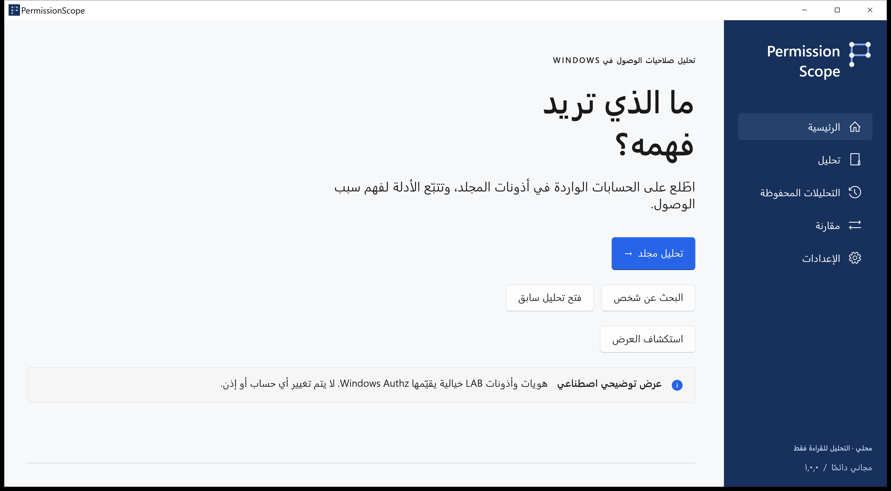
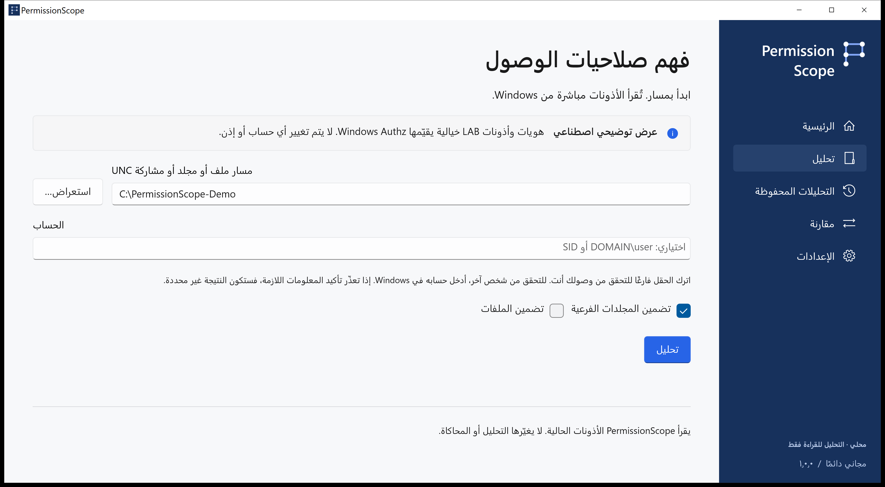
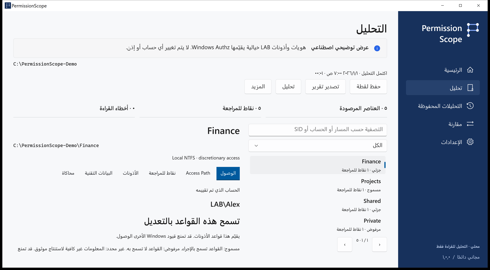
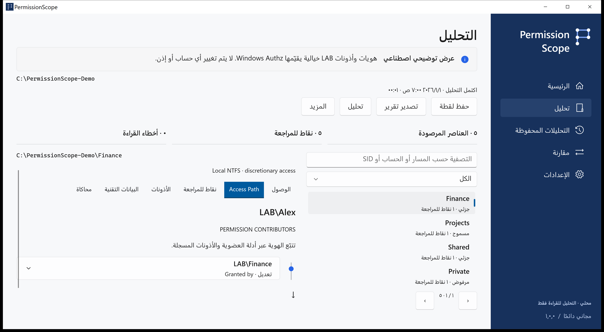
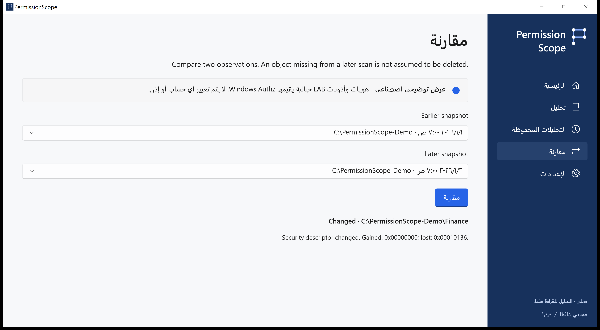
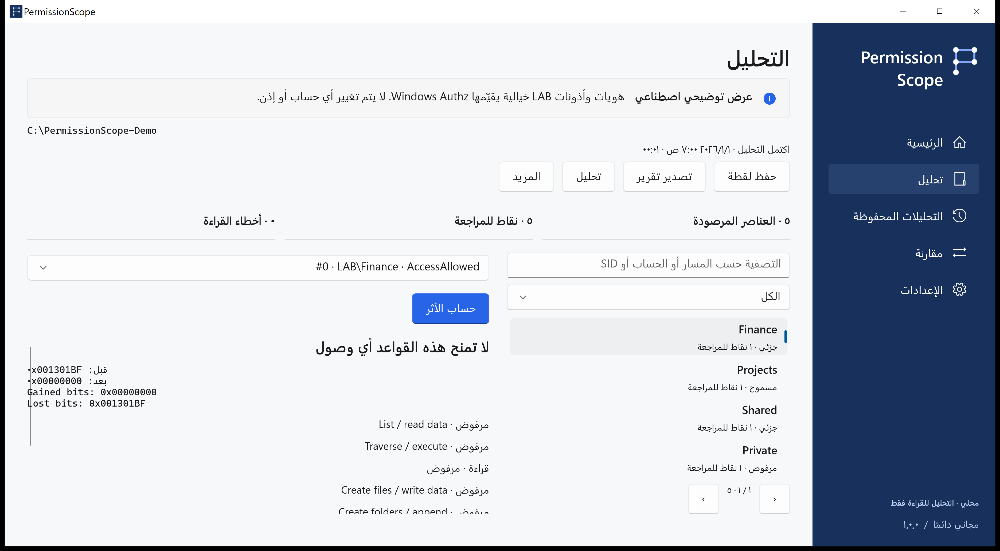
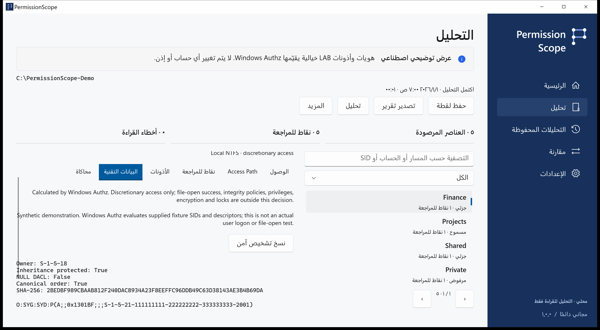
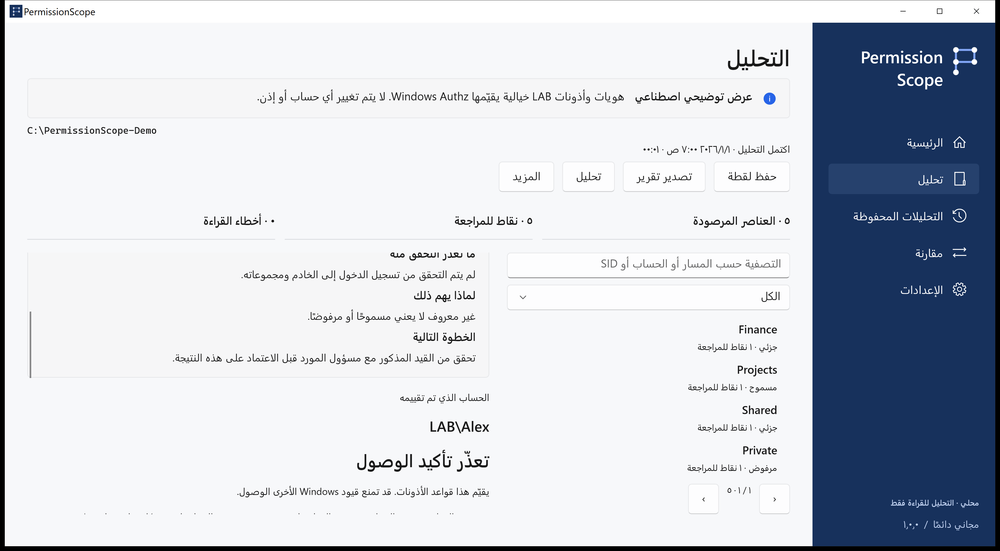

# PermissionScope · دليل مرئي

[اختر الخطوة التالية](../../README.ar.md)

يحصل LAB\Alex على التعديل عبر LAB\Finance. لقطات أصلية لسيناريو اصطناعي يقيّمه Authz، بلا بيانات شركة حقيقية أو نتائج معدّلة.

## home

استكشف العرض باستخدام LAB\Alex. لملفاتك، اختر تحليل وحدد مجلدًا.

## analyze

اترك الهوية فارغة لاستخدام رمز Windows الحالي. افتح Access Path لفحص الأدلة.

## access

مسموح يتيح الإجراء وفق قواعد الوصول التقديرية التي تم تقييمها. جزئي يتيح بعض الإجراءات. مرفوض لا يمنح وصولًا. غير معروف يعني أن السياق لا يكفي لتأكيد النتيجة؛ ولا يُعامل كمسموح مطلقًا.

## access-path

يحسب Windows Authz قناع الأذونات. يعرض Access Path القواعد المساهمة والعضويات المسجلة. علامة التوريث لا تثبت المجلد الأصلي. التحكم الكامل في ACL لا يضمن فتح الملف.

## compare

احفظ لقطات محلية، وقارن الملاحظات، وحاكِ إزالة قاعدة في الذاكرة، وصدّر HTML أو CSV أو JSON أو XLSX أو PDF. غياب مورد في ملاحظة لاحقة لا يثبت حذفه.

## simulation

التحليل والمحاكاة للقراءة فقط. تطبيق التغيير مسار منفصل بتأكيد صريح، للملفات المحلية العادية، مع لقطة وسجل دائم وتحقق وتراجع. المجلدات والروابط والملفات ذات الروابط الصلبة المتعددة مستثناة.

## technical

أرفق الإصدار ونسخة Windows والعملية ورمز الخطأ. تنسخ علامة التبويب التقنية تشخيصًا بلا مسارات أو حسابات أو SID. الترجمات أولية؛ قد تبقى الأدلة التقنية بالإنجليزية. لا ندّعي مراجعة ناطق أصلي أو اعتماد تقنيات مساعدة.

## unknown

تظل عمليات الدخول البعيدة وسياقات S4U والقواعد الشرطية وأهداف الروابط غير المتحقق منها غير معروفة. سياسات السلامة والتشفير والأقفال والامتيازات خارج القرار. بلا قياس استخدام أو حساب أو سحابة. قد تتضمن التقارير الحقيقية مسارات وأسماء حساسة.

[Development](../development.md) · [الأسئلة واستكشاف الأخطاء](../faq.md) · [حالة الإصدار](../release-status.md)
