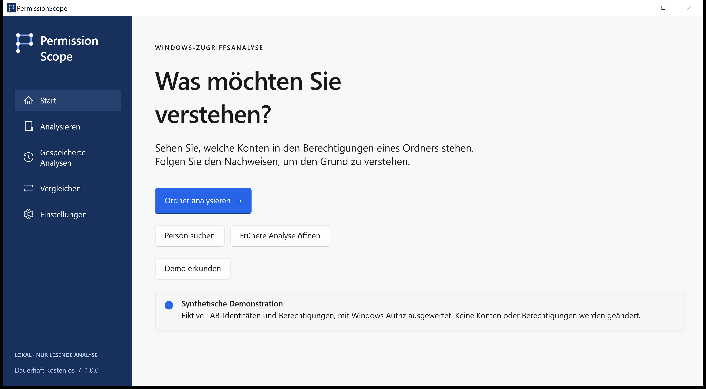
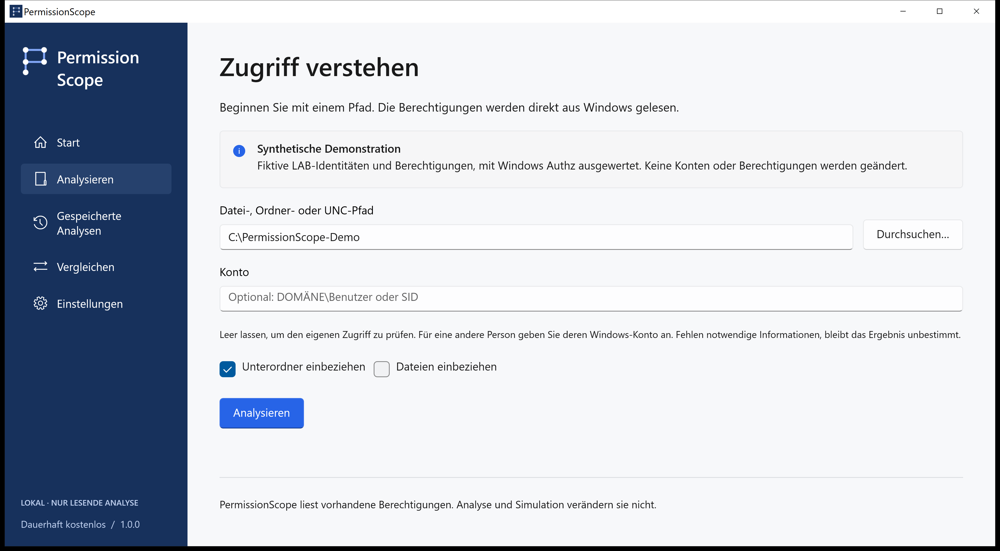
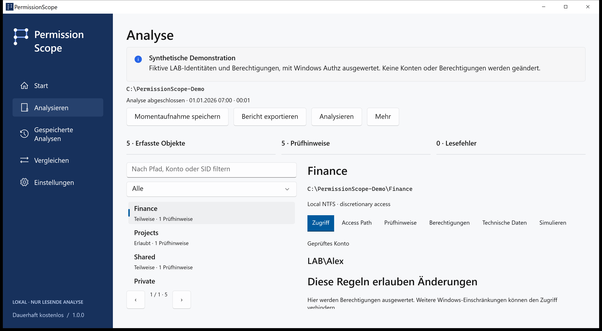
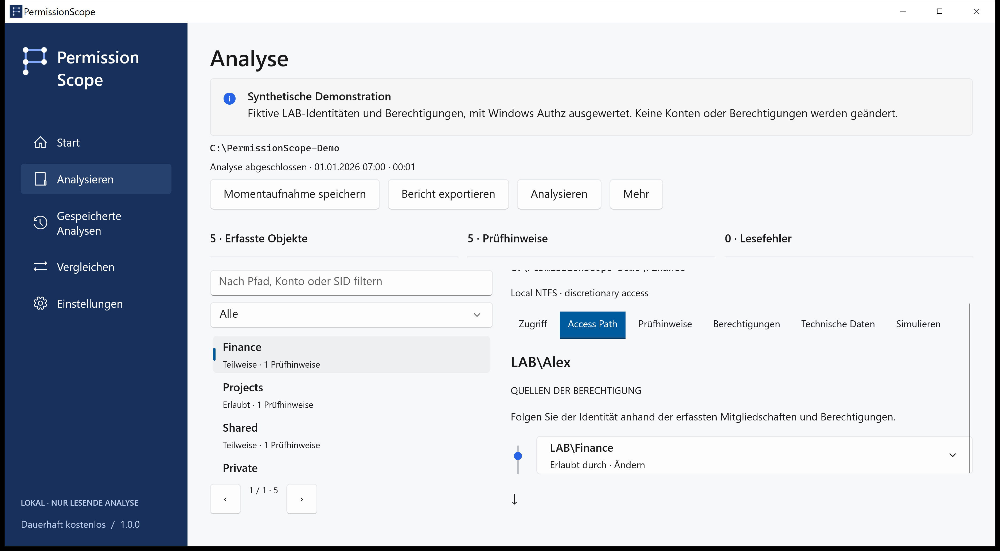
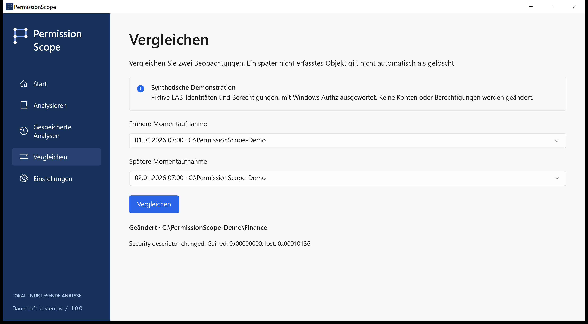
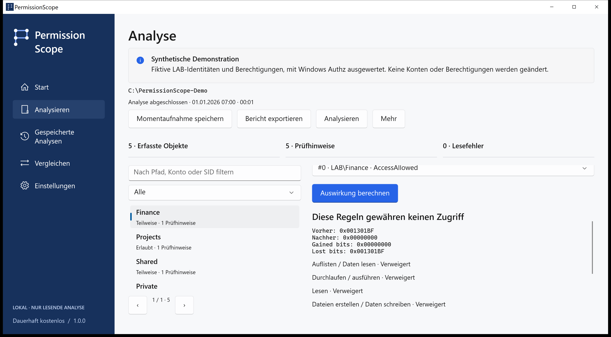

# PermissionScope · Visuelle Anleitung

[Nächsten Schritt wählen](../../README.de.md)

LAB\Alex erhält Ändern über LAB\Finance. Native Aufnahmen eines synthetischen Authz-Szenarios, ohne echte Unternehmensdaten oder nachträglich veränderte Ergebnisse.

## home

Erkunden Sie die Demo mit LAB\Alex. Für eigene Dateien wählen Sie Analysieren und einen Ordner.

## analyze

Lassen Sie die Identität leer, um Ihr aktuelles Windows-Token zu verwenden. Prüfen Sie die Nachweise unter Access Path.

## access

Erlaubt gestattet die Aktion nach den ausgewerteten diskretionären Regeln. Teilweise erlaubt bestimmte Aktionen. Verweigert gewährt keinen Zugriff. Unbekannt bedeutet, dass der Kontext keine zuverlässige Aussage erlaubt; es zählt niemals als Erlaubnis.

## access-path

Windows Authz berechnet die Maske. Access Path zeigt beitragende Einträge und erfasste Mitgliedschaften. Das Vererbungsmerkmal belegt nicht den Ursprungsordner. Vollzugriff in der ACL garantiert nicht, dass eine Datei geöffnet werden kann.

## compare

Speichern Sie lokale Momentaufnahmen, vergleichen Sie Beobachtungen, simulieren Sie das Entfernen einer Regel im Speicher und exportieren Sie HTML, CSV, JSON, XLSX oder PDF. Später nicht beobachtete Ressourcen gelten nicht automatisch als gelöscht.

## simulation

Analyse und Simulation lesen nur. Anwenden ist ein separater, ausdrücklich bestätigter Ablauf für normale lokale Dateien mit Momentaufnahme, dauerhaftem Journal, Prüfung und Rücknahme. Ordner, Links und Dateien mit mehreren Hardlinks sind ausgeschlossen.

## technical

Version, Windows-Version, Vorgang und Fehlercode angeben. Technik kopiert eine Diagnose ohne Pfade, Konten oder SIDs. Übersetzungen sind vorläufig; technische Nachweise können Englisch bleiben. Keine behauptete muttersprachliche Prüfung oder Assistenztechnik-Zertifizierung.

## unknown

Remote-Anmeldungen, S4U-Kontexte, bedingte Regeln und ungeprüfte Linkziele bleiben Unbekannt. Integrität, Verschlüsselung, Sperren und Privilegien sind nicht erfasst. Keine Telemetrie, Konten oder Cloud. Echte Exporte können sensible Pfade und Kontonamen enthalten.

[Development](../development.md) · [Fragen und Fehlerbehebung](../faq.md) · [Versionsstatus](../release-status.md)
