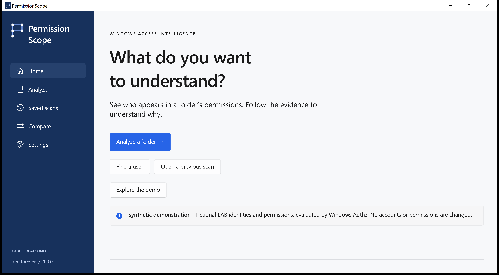
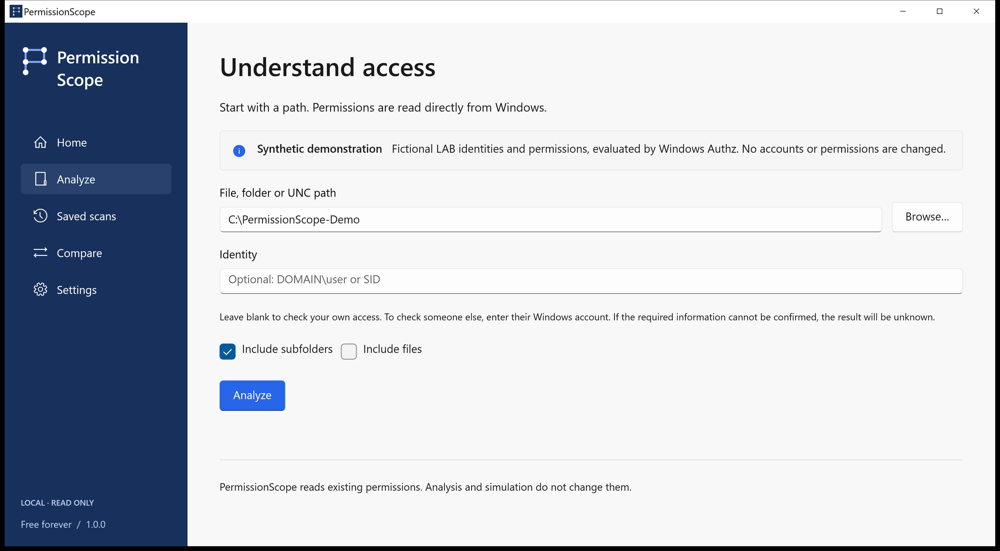
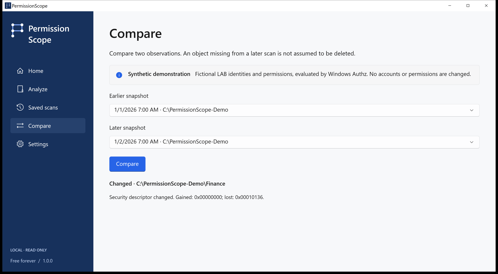
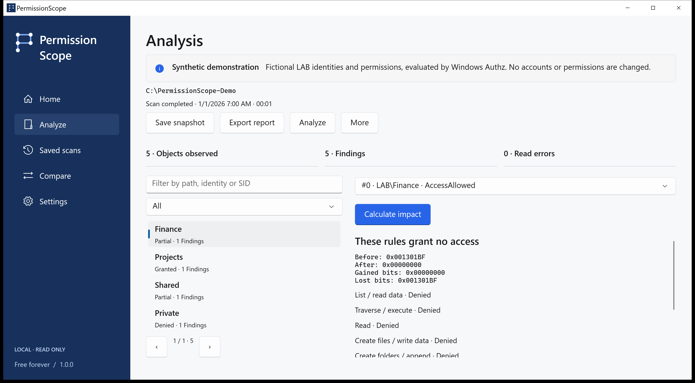

# PermissionScope · Visual walkthrough

[Choose your next step](../../README.md)

LAB\Alex receives Modify through LAB\Finance. These are native application captures using a synthetic Authz fixture, not a real company or altered results.

## home

Choose Explore the demo to learn safely with LAB\Alex. For your files, choose Analyze and enter a folder.

## analyze

Leave the identity blank to use your current Windows token. Open Access Path to inspect the evidence.

## access

Granted allows the named action under the evaluated discretionary rules. Partial means only some actions are allowed. Denied means those rules grant no access. Unknown means the available context cannot confirm the answer; it is never treated as granted.

## access-path

Windows Authz calculates the mask. Access Path shows contributing entries and recorded membership evidence. Inherited flags do not prove the originating ancestor. Full control in the discretionary ACL does not guarantee a successful file open.

## compare

Save local snapshots, compare observations, simulate removing a permission entry in memory, and export HTML, CSV, JSON, XLSX or PDF. Missing resources in a later observation are not assumed deleted.

## simulation

Analysis and simulation are read only. Applying a change is a separate, explicitly confirmed workflow for ordinary local files, with a saved observation, durable journal, verification and rollback. Directories, links and multi-link files are excluded.

## technical

Include the version, Windows version, operation and error code. The Technical tab can copy a diagnostic without paths, account names or SIDs. Language packs are previews; technical evidence can remain in English. Native speaker review and assistive-technology certification are not claimed.

## unknown

Remote logons, S4U contexts, conditional rules and unverified reparse targets remain Unknown. Integrity policy, encryption, locks and administrative privileges are outside this decision. No application telemetry, accounts or cloud service. Paths and account names in real exports can be sensitive.

[Development](../development.md) · [FAQ and troubleshooting](../faq.md) · [Release status](../release-status.md)
