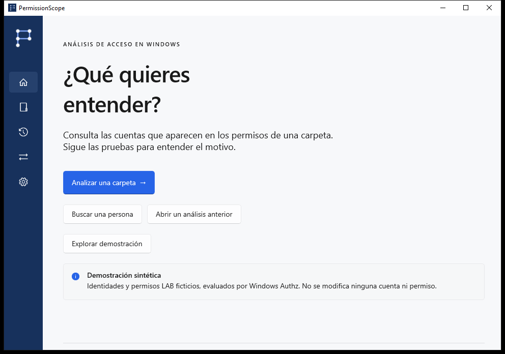
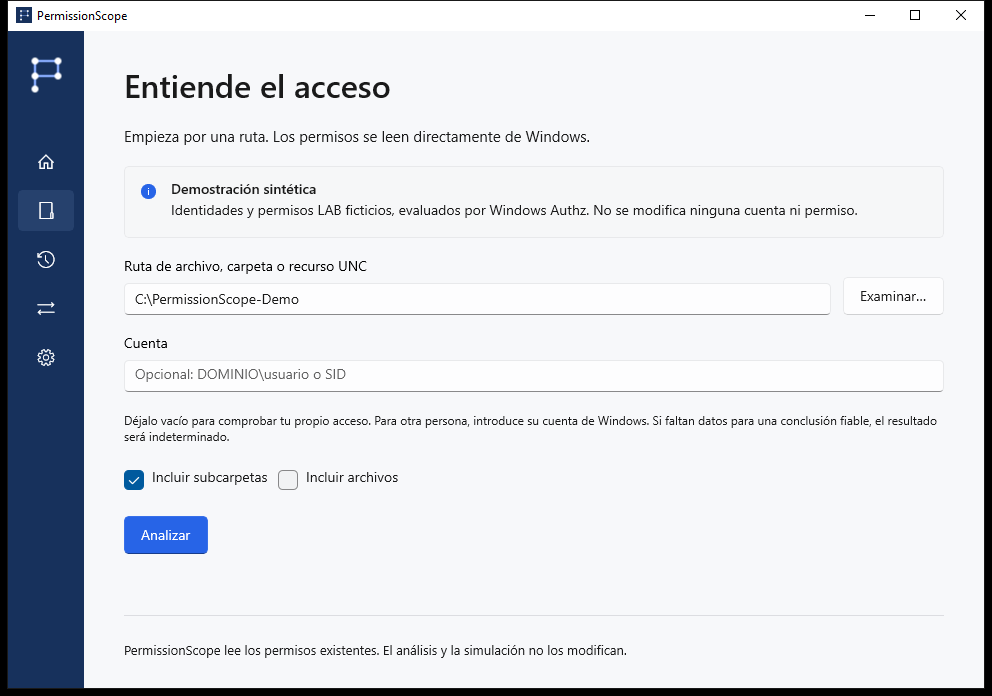
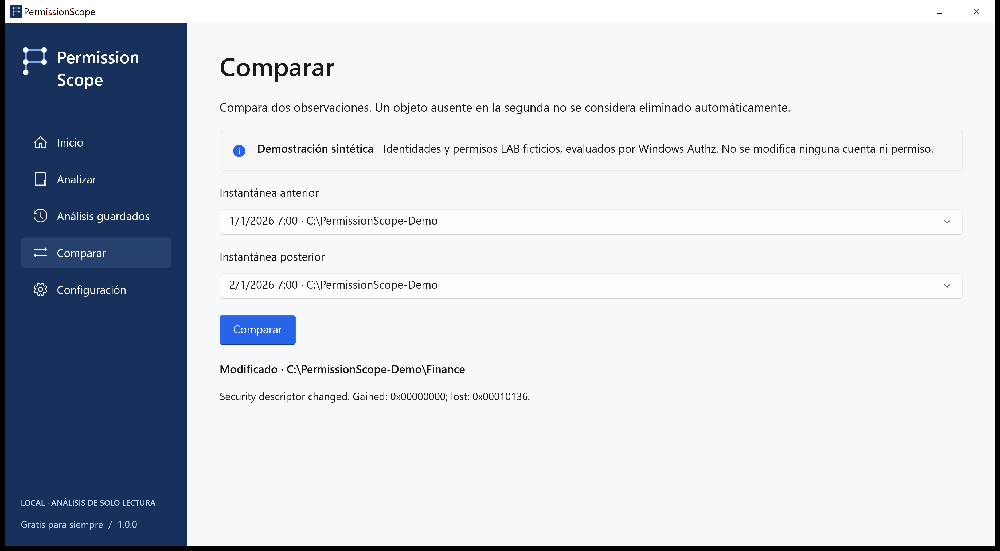

# PermissionScope · Guía visual

[Elija el siguiente paso](https://github.com/MukaSanches/PermissionScope/blob/main/README.es.md)

LAB\Alex recibe Modificar mediante LAB\Finance. Capturas nativas de un escenario sintético evaluado por Authz; sin datos empresariales reales ni resultados retocados.

## home

Explore la demostración con LAB\Alex. Para sus archivos, elija Analizar e indique una carpeta.

## analyze

Deje la identidad vacía para usar su token actual de Windows. Abra Access Path para revisar las pruebas.

## access

Permitido autoriza la acción según las reglas discrecionales evaluadas. Parcial permite algunas acciones. Denegado no concede acceso. Desconocido indica que falta contexto para confirmar el resultado; nunca equivale a permitido.

## access-path

Windows Authz calcula la máscara. Access Path muestra las entradas contribuyentes y las relaciones registradas. La marca de herencia no demuestra el antecesor de origen. El control total en la ACL no garantiza abrir un archivo.

## compare

Guarde instantáneas locales, compare observaciones, simule quitar una regla en memoria y exporte HTML, CSV, JSON, XLSX o PDF. Un recurso ausente en la observación posterior no se considera eliminado.

## simulation

El análisis y la simulación son de solo lectura. Aplicar un cambio es un proceso separado, confirmado explícitamente, para archivos locales normales, con instantánea, registro, verificación y reversión. Se excluyen carpetas, enlaces y archivos con varios enlaces físicos.

## technical

Incluya versión, Windows, operación y código de error. La pestaña Técnica copia un diagnóstico sin rutas, cuentas ni SID. Las traducciones son preliminares; las pruebas técnicas pueden seguir en inglés. No se afirma revisión nativa ni certificación de tecnologías de asistencia.

## unknown

Los contextos remotos, S4U, reglas condicionales y destinos de enlaces no verificados siguen siendo Desconocidos. Integridad, cifrado, bloqueos y privilegios quedan fuera. Sin telemetría, cuentas ni nube. Las exportaciones reales pueden contener rutas y nombres sensibles.

[Development](../development.md) · [Preguntas y problemas](../faq.md) · [Estado de la versión](../release-status.md)
