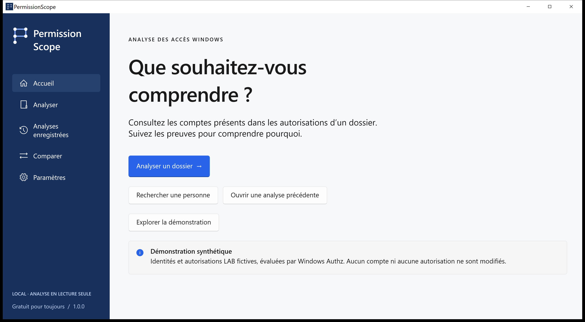
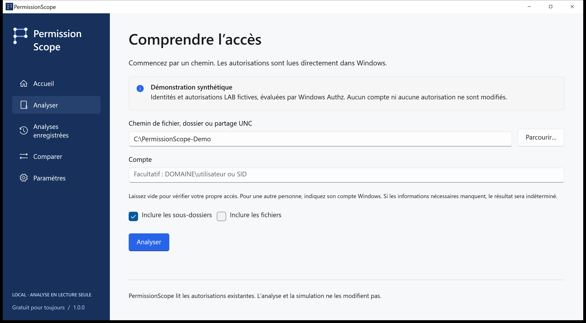
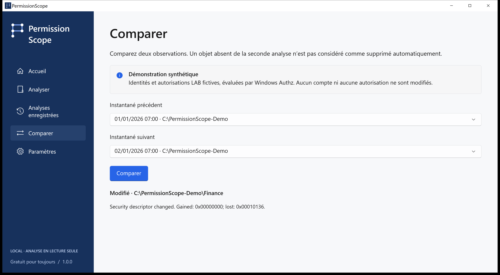

# PermissionScope · Guide visuel

[Choisir la suite](../../README.fr.md)

LAB\Alex obtient Modification via LAB\Finance. Captures natives d’un scénario synthétique évalué par Authz, sans données d’entreprise réelles ni résultats retouchés.

## home

Explorez la démonstration avec LAB\Alex. Pour vos fichiers, choisissez Analyser et indiquez un dossier.

## analyze

Laissez l’identité vide pour utiliser votre jeton Windows actuel. Ouvrez Access Path pour vérifier les preuves.

## access

Autorisé permet l’action selon les règles discrétionnaires évaluées. Partiel permet certaines actions. Refusé n’accorde aucun accès. Inconnu signifie que le contexte ne suffit pas à confirmer la réponse ; il ne vaut jamais autorisation.

## access-path

Windows Authz calcule le masque. Access Path présente les entrées contributrices et les appartenances enregistrées. Un indicateur d’héritage ne prouve pas l’ancêtre d’origine. Le contrôle total dans l’ACL ne garantit pas l’ouverture d’un fichier.

## compare

Enregistrez des instantanés locaux, comparez les observations, simulez le retrait d’une règle en mémoire et exportez en HTML, CSV, JSON, XLSX ou PDF. Une ressource absente d’une observation ultérieure n’est pas présumée supprimée.

## simulation

Analyse et simulation sont en lecture seule. Appliquer est un processus distinct, confirmé explicitement, limité aux fichiers locaux ordinaires, avec instantané, journal durable, vérification et restauration. Dossiers, liens et fichiers à liens physiques multiples sont exclus.

## technical

Indiquez version, Windows, opération et code d’erreur. L’onglet Technique copie un diagnostic sans chemins, comptes ni SID. Traductions préliminaires ; les preuves techniques peuvent rester en anglais. Aucune relecture native ni certification d’assistance n’est revendiquée.

## unknown

Les connexions distantes, contextes S4U, règles conditionnelles et cibles de liens non vérifiées restent Inconnus. Intégrité, chiffrement, verrous et privilèges sont hors périmètre. Sans télémétrie, compte ni service cloud. Les exports réels peuvent contenir des chemins et noms sensibles.

[Development](../development.md) · [Questions et dépannage](../faq.md) · [État de la version](../release-status.md)
