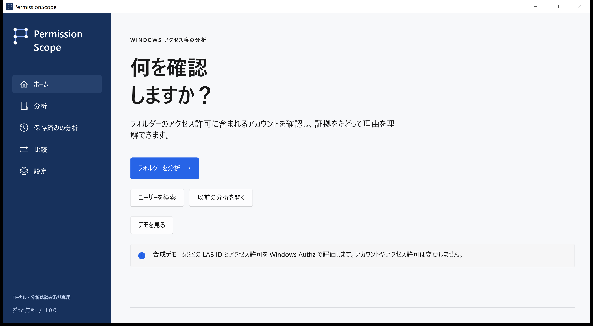
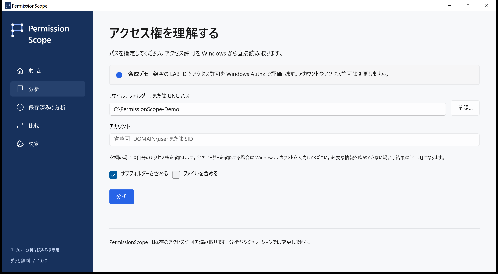
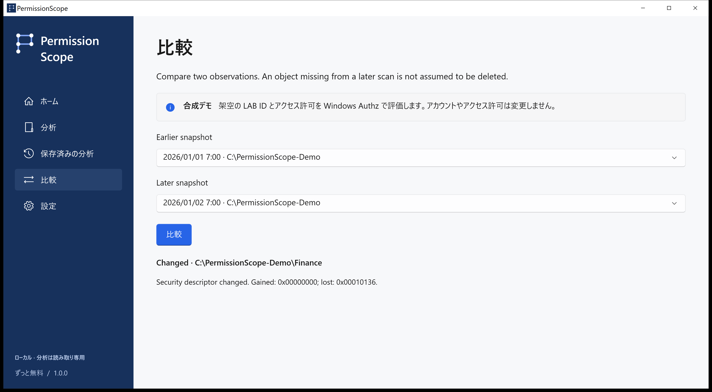
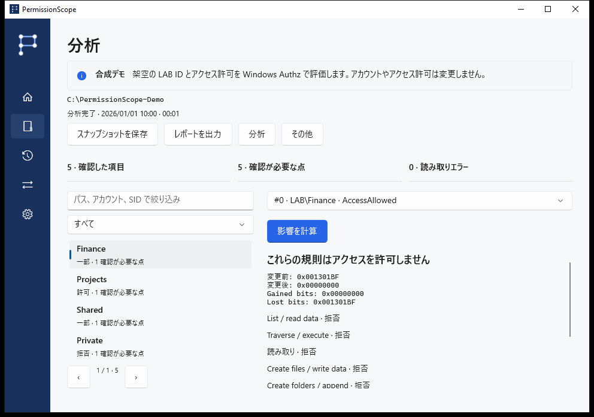
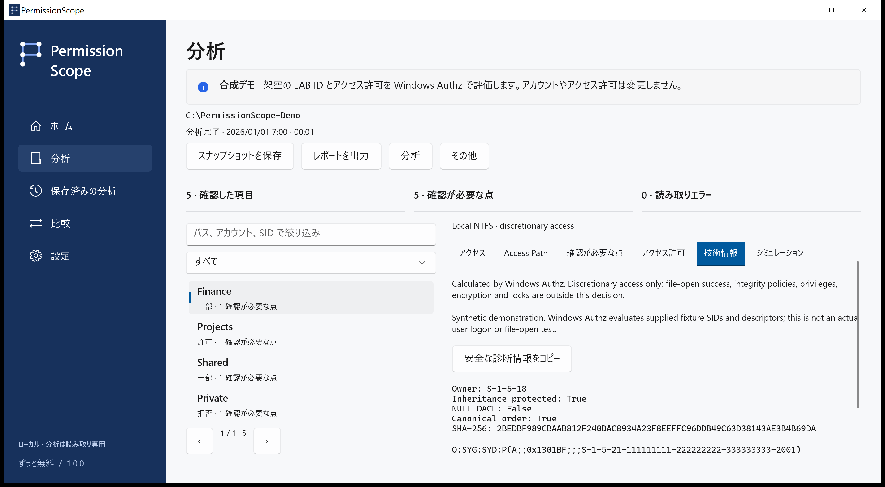
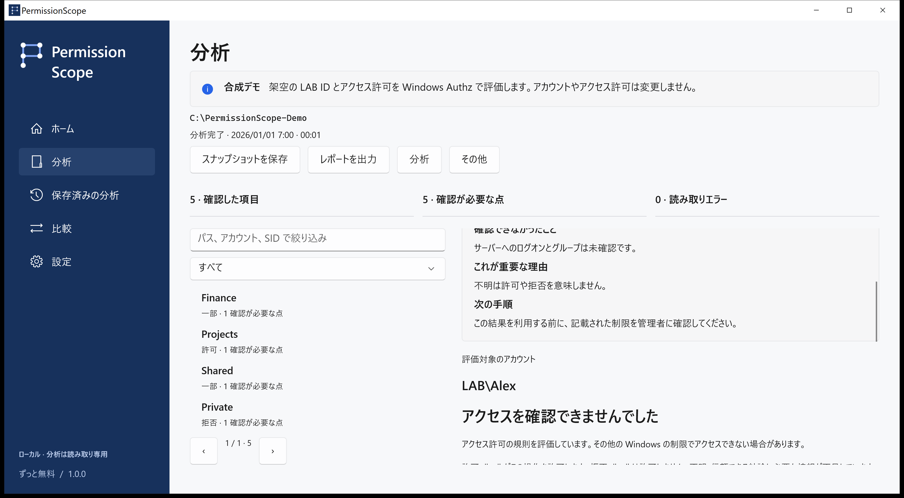

# PermissionScope · 画面付きガイド

[次の手順](https://github.com/MukaSanches/PermissionScope/blob/main/README.ja.md)

LAB\Alex は LAB\Finance を通じて変更権限を得ます。Authz で評価した合成シナリオのネイティブ画面です。実際の企業データや加工した結果ではありません。

## home

LAB\Alex のデモを試します。自分のファイルでは分析を選び、フォルダーを指定します。

## analyze

ID を空欄にすると現在の Windows トークンを使います。Access Path で根拠を確認します。

## access

許可は評価した任意アクセス制御の規則が操作を許すことです。一部は特定の操作のみ許可、拒否はアクセスの付与なしです。不明は判断に必要な情報が不足している状態で、許可として扱いません。

## access-path

Windows Authz がマスクを計算します。Access Path は寄与するエントリと記録された所属を示します。継承フラグは元の祖先を証明しません。ACL のフルコントロールもファイルを開ける保証にはなりません。

## compare

ローカルのスナップショットを保存・比較し、メモリ内で規則の削除をシミュレーションして HTML、CSV、JSON、XLSX、PDF に出力できます。後の観測で見つからないリソースを削除済みと断定しません。

## simulation

分析とシミュレーションは読み取り専用です。適用は明示的な確認を伴う別の手順で、通常のローカルファイルのみが対象です。保存、永続ログ、検証、ロールバックを行います。フォルダー、リンク、複数のハードリンクを持つファイルは対象外です。

## technical

バージョン、Windows、操作、エラーコードを記載してください。技術タブではパス、アカウント、SID を除いた診断をコピーできます。翻訳はプレビューで、技術的根拠は英語の場合があります。母語話者によるレビューや支援技術の認証は主張しません。

## unknown

リモートログオン、S4U、条件付き規則、未確認のリンク先は不明のままです。整合性ポリシー、暗号化、ロック、特権は判定範囲外です。テレメトリ、アカウント、クラウドは不要です。実データのレポートには機密のパスや名前が含まれ得ます。

[Development](../development.md) · [質問とトラブル対処](../faq.md) · [リリース状況](../release-status.md)
