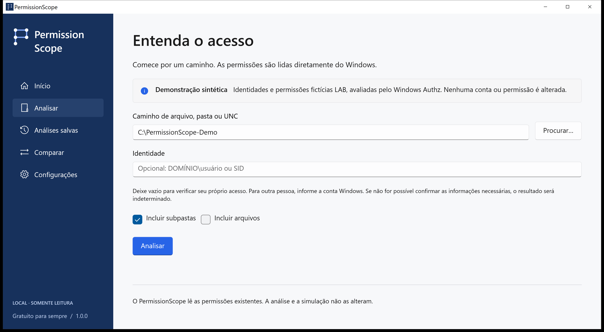
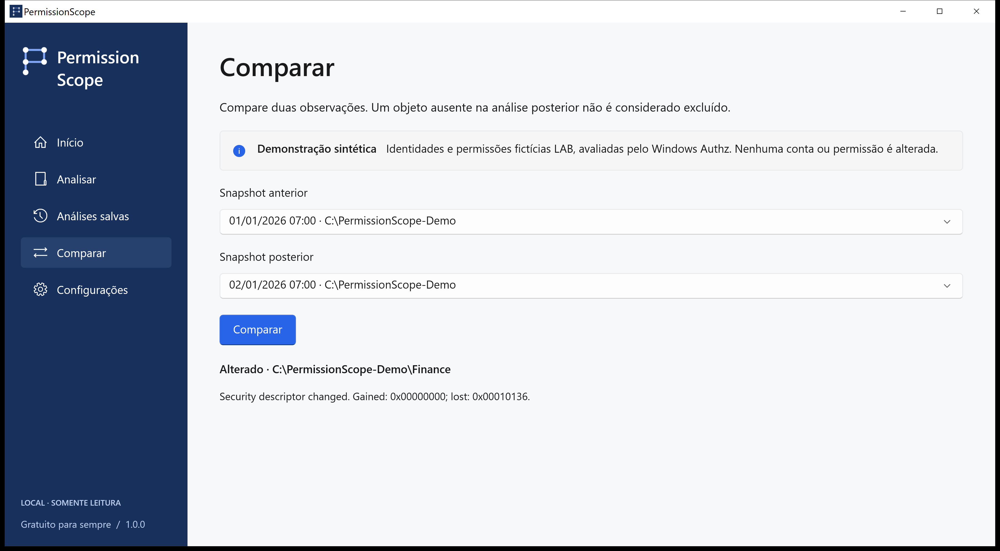
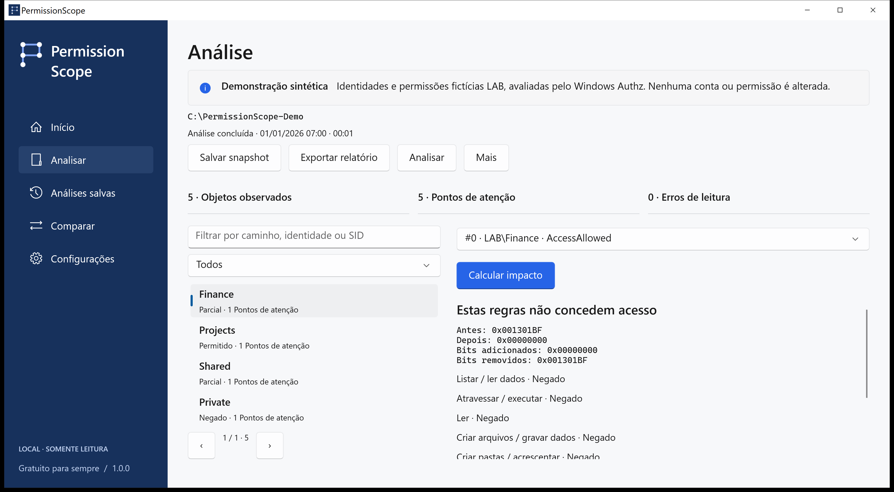

# PermissionScope · Guia visual

[Escolha o próximo passo](../../README.pt-BR.md)

LAB\Alex recebe Modificar por LAB\Finance. As capturas são do aplicativo nativo com uma demonstração sintética avaliada por Authz, sem dados de uma empresa real nem resultados alterados.

## home

Escolha Explorar demonstração para aprender com LAB\Alex. Para seus arquivos, escolha Analisar e informe uma pasta.

## analyze

Deixe a identidade vazia para usar seu token Windows atual. Abra Access Path para conferir as evidências.

## access

Permitido autoriza a ação indicada pelas regras discricionárias avaliadas. Parcial permite apenas algumas ações. Negado significa que essas regras não concedem acesso. Desconhecido indica contexto insuficiente para confirmar a resposta; nunca é tratado como permitido.

## access-path

O Windows Authz calcula a máscara. Access Path mostra as entradas que contribuem e as associações registradas. O sinalizador de herança não comprova a pasta de origem. Controle total na ACL discricionária não garante que um arquivo possa ser aberto.

## compare

Salve snapshots locais, compare observações, simule a remoção de uma regra em memória e exporte HTML, CSV, JSON, XLSX ou PDF. Um recurso ausente na observação posterior não é considerado excluído automaticamente.

## simulation

Análise e simulação apenas leem. Aplicar é um fluxo separado, confirmado explicitamente, para arquivos locais comuns, com observação salva, registro durável, verificação e reversão. Pastas, links e arquivos com vários hard links são excluídos.

## technical

Informe versão, Windows, operação e código de erro. A aba Técnica copia um diagnóstico sem caminhos, contas ou SIDs. Traduções são prévias; evidências técnicas podem permanecer em inglês. Não alegamos revisão por falantes nativos nem certificação assistiva.

## unknown

Logons remotos, contextos S4U, regras condicionais e destinos de links não verificados permanecem Desconhecidos. Integridade, criptografia, bloqueios e privilégios administrativos ficam fora dessa decisão. Sem telemetria, conta ou serviço em nuvem. Caminhos e nomes em exportações reais podem ser sensíveis.

[Development](../development.md) · [Perguntas e solução de problemas](../faq.md) · [Status da versão](../release-status.md)
