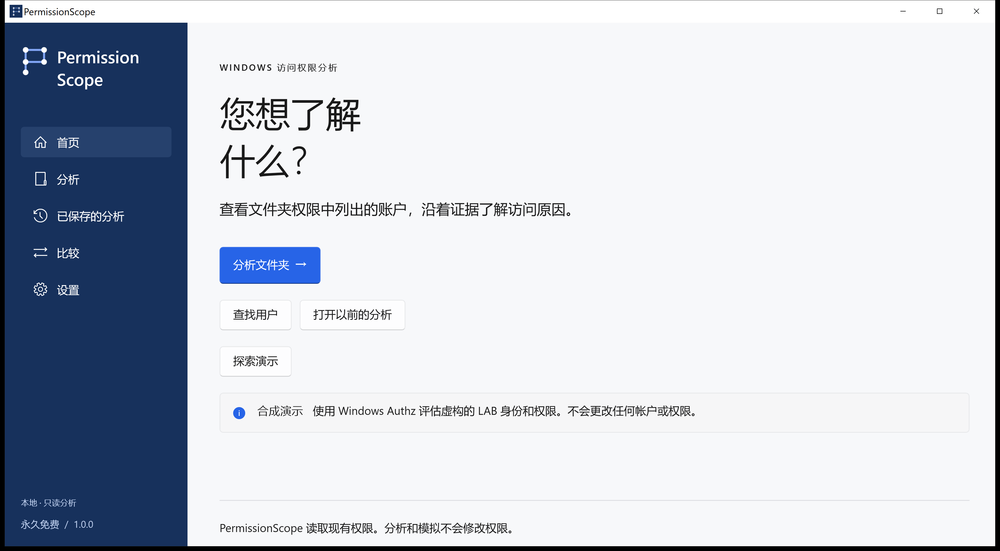
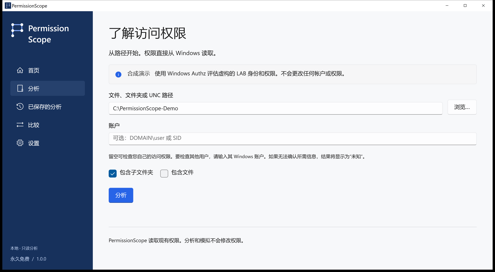
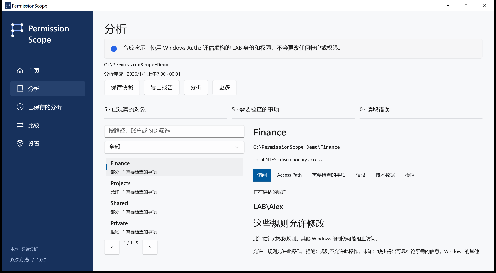
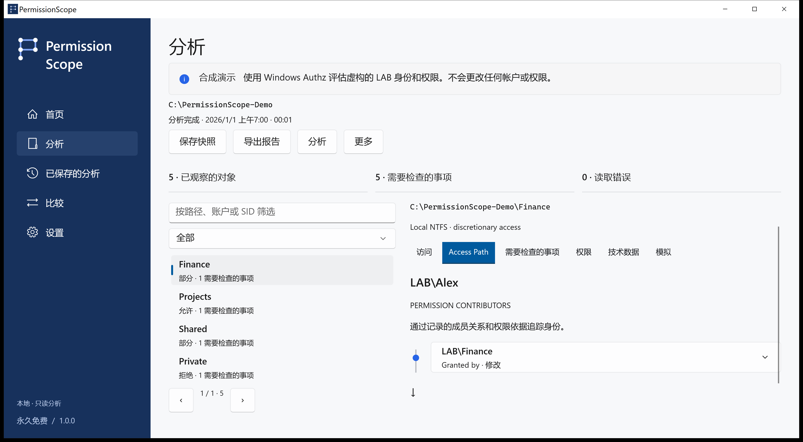
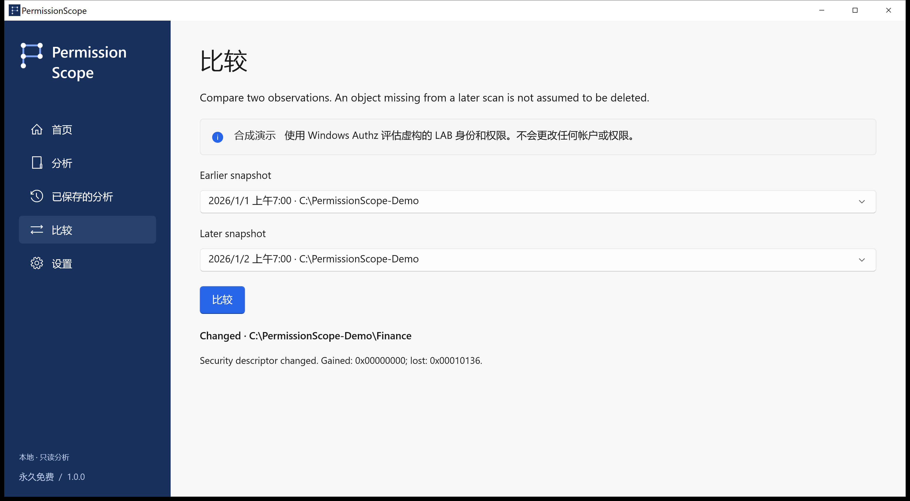
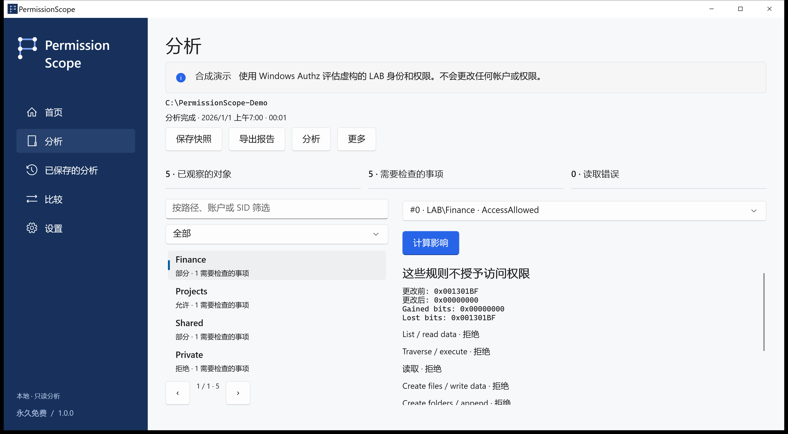
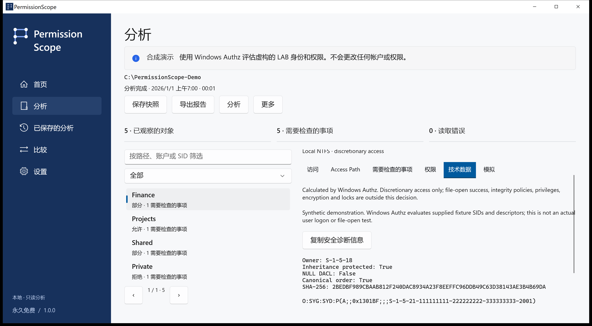
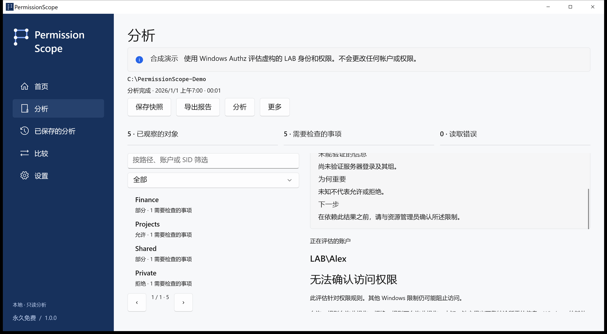

# PermissionScope · 图文指南

[选择下一步](../../README.zh-Hans.md)

LAB\Alex 通过 LAB\Finance 获得修改权限。这些是由 Authz 评估合成场景的原生应用截图，不包含真实企业数据或经修改的结果。

## home

使用 LAB\Alex 探索演示。分析自己的文件时，选择分析并输入文件夹。

## analyze

将身份留空以使用当前 Windows 令牌。打开 Access Path 查看依据。

## access

允许表示评估的自主访问控制规则允许指定操作。部分表示允许某些操作。拒绝表示这些规则不授予访问权限。未知表示上下文不足以确认结果，绝不当作允许。

## access-path

Windows Authz 计算权限掩码。Access Path 显示有贡献的条目和已记录的成员关系。继承标志不能证明来源祖先。自主 ACL 中的完全控制也不保证能打开文件。

## compare

保存本地快照、比较观测、在内存中模拟移除规则，并导出 HTML、CSV、JSON、XLSX 或 PDF。后续观测中未出现的资源不会被自动判定为已删除。

## simulation

分析和模拟为只读操作。应用更改是单独且需明确确认的流程，仅适用于普通本地文件，并包含快照、持久日志、验证和回滚。文件夹、链接及具有多个硬链接的文件除外。

## technical

请提供版本、Windows 版本、操作和错误码。技术选项卡可复制不含路径、帐户或 SID 的诊断信息。翻译为预览版，技术依据可能仍为英文。不声称已完成母语审核或辅助技术认证。

## unknown

远程登录、S4U 上下文、条件规则和未经验证的链接目标仍为未知。完整性策略、加密、锁和特权不在本次判定范围内。无遥测、帐户或云服务。真实导出可能包含敏感路径和帐户名称。

[Development](../development.md) · [常见问题与故障排查](../faq.md) · [版本状态](../release-status.md)
